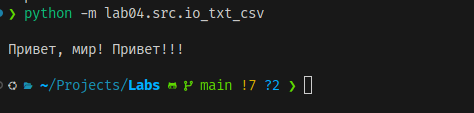
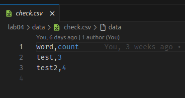
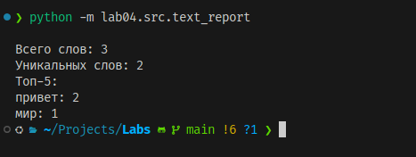
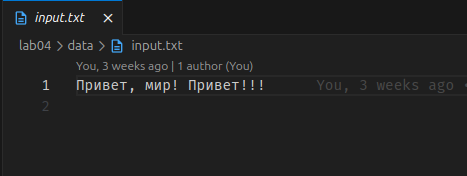
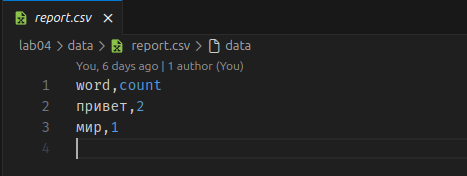

<h1>Python_Labs</h1>

# Лабораторная работа 1


## Задания

### Задание 1:

Программа выводит простое приветствие в консоль.

**Код:**
```python
name = input("Имя: ")
age = int(input("Возраст: "))
print(f"Привет, {name}! Через год тебе будет {age}.")
```
Результат выполнения:


### Задание 2: 

Код:

```python
a = (input("a: ")).replace(",",".")
b = (input("b: ")).replace(",",".")
print(f"sum={round(float(a)+float(b), 2)}; avg={round((float(a)+float(b))/2, 2)}")
```
Результат выполнения:


### Задание 3: 

```python
price = int(input())
discount = int(input())
vat = int(input())
base = price * (1 - discount/100)
vat_amount = base * (vat/100)
total = base + vat_amount
print(f"База после скидки: {base:.2f} ₽")
print(f"НДС:               {vat_amount:.2f} ₽")
print(f"Итого к оплате:    {total:.2f} ₽")
```
Результат выполнения:


### Задание 4: 

```python
mm = int(input("Минуты: "))
hh = mm//60
print(f"{hh}:{(mm-60*hh):02d}")
```
Результат выполнения:


### Задание 5:

```python
fio = input("ФИО: ").split()
I = ''
for i in range(3):
    I += fio[i][0]
print(f"Инициалы: {I}.")
print(sum(len(i) for i in fio)+2)
```

Результат выполнения:


### Задание 6:
```python
n = int(input())
ochno = 0
for i in range(n):
    surname, name, age, form = map(str, input().split(' '))
    if form == 'True':
        ochno+=1
print(ochno, n-ochno)
```

Результат выполнения:


### Задание 7:
```python
cipher = input()
ans = ''
n = 0
for i in range(len(cipher)):
    if cipher[i].isupper():
        ans+=cipher[i]
        n = i+1
        break

for i in range(len(cipher)):
    for j in range(2,1000,3):
        if i == n+j:
            ans+=cipher[i]
print(ans)
```

Результат выполнения:


# Лабораторная работа 2
### Задание 1:

```python
def min_max(nums):
    if nums==[]:
        return 'ValueError'
    else:
        return (min(nums),max(nums))

def unique_sorted(nums):
    return sorted(set(nums), reverse=False)
def flatten(mat):
    new_mat = []
    for i in mat:
        for j in i:
            if type(j) == str:
                return 'TypeError'
            new_mat.append(j)
    return (new_mat)
```

Результат выполнения:


### Задание 2:

```python

def transpose(mat):
    if len(mat) == 0:
        return []
    elif len(mat) == 1:
        b = [[] for _ in range(len(mat[0]))]
        for i in range(len(mat[0])):
            b[i] += [(mat[0][i])]
        return b
    elif all(len(mat[i]) == 1 for i in range(len(mat))):
        c = [[]]
        for k in mat:
            c[0] += k
        return c
    elif all(len(mat[i]) == len(mat[i + 1]) for i in range(len(mat[0]) - 1)):
        a = [[] for _ in range(len(mat))]
        for k in range(len(mat)):
            for i in range(len(mat[0])):
                a[k] += [mat[i][k]]
        return a
    else:
        return 'ValueError'

def row_sums(mat):
    k = len(mat[0])
    ans = []
    for i in mat:
        if k == len(i):
            ans.append(sum(i))
        else:
            return 'ValueError'
    return ans

def col_sums(mat):
    ans = [0]*len(mat[0])
    k = len(mat[0])
    for i in range(len(mat)):
        if k==len(mat[i]):
            for j in range(len(mat[i])):
                ans[j]+=mat[i][j]
        else:
            return 'ValueError'
    return ans
```

Результат выполнения:


### Задание 3:

```python
fio_new = ''
flag1 = False
len_fio = 0
gpa = float
s = input().replace('(','').replace(')','').split(', ')
for i in s:
    if i == '':
        s.append('musor')
if len(s) == 3:
    fio_old = s[0].replace('''"''','').split(' ')
    for i in fio_old:
        if i != '' and flag1 == False:
            fio_new += str(i.capitalize())+' '
            len_fio+=1
            flag1 = True
        elif flag1 == True and i!='':
            fio_new += str(i.capitalize()[0]) + '.'
            len_fio+=1
    group = s[1].replace('''"''','')
    gpa = float(s[2])
    if 3>=len_fio>=2:
        print(f'''"{fio_new}, гр. {group}, GPA {gpa:.2f}"''')
    else:
        print('ValueError')
else: print('ValueError')
```

Результат выполнения:


# Лабораторная работа 3
### Задание 1:

```python
import re
def normalize(text: str, casefold: bool, yo2e: bool):
    text = ' '.join(text.split())
    if casefold:
        text = text.casefold()
    if yo2e:
        text = text.replace("ё","е").replace('Ё', 'Е')
    return text

print(normalize("ПрИвЕт\nМИр\t", True,False))
print(normalize("ёжик, Ёлка", False,True))
print(normalize("Hello\r\nWorld", False,False))
print(normalize("  двойные   пробелы  ", False,False))
def tokenize(text: str):
    text=text.replace(',', ' ').replace('.',' ')
    return re.sub(r'[^a-zA-Zа-яА-Я0-9-\s]', '', text).split()
print(tokenize("привет мир"))
print(tokenize("hello,world!!!"))
print(tokenize("по-настоящему круто"))
print(tokenize("2025 год"))
print(tokenize("emoji 😀 не слово"))

def count_freq(tokens: list[str]):
    freq = {}
    for i in tokens:
        if i in freq:
            freq[i] += 1
        else:
            freq[i] = 1
    return freq
def top_n(freq: dict[str, int], n: int):
    s = sorted(freq.items(), key=lambda x: (-x[1], x[0]))
    return s[:n]
print(count_freq(["a","b","a","c","b","a"]))
print(top_n(count_freq(["a","b","a","c","b","a"]),2))
print((count_freq(["bb","aa","bb","aa","cc"])))
print(top_n(count_freq(["bb","aa","bb","aa","cc"]),2))
```

Результат выполнения:


### Задание 2:

```python
import sys
import io

# true - красивый табличный вывод; false - стандарт
PRETTY_TABLE_OUTPUT = True

try:
    sys.stdin = io.TextIOWrapper(sys.stdin.buffer, encoding='utf-8')
    sys.stdout = io.TextIOWrapper(sys.stdout.buffer, encoding='utf-8')
    sys.stderr = io.TextIOWrapper(sys.stderr.buffer, encoding='utf-8')
except TypeError:
    pass

from text import normalize, tokenize, count_freq, top_n


def print_simple_output(total, unique, top_words):
    print(f"Всего слов: {total}")
    print(f"Уникальных слов: {unique}")
    print("Топ-5:")
    for word, count in top_words:
        print(f"{word}:{count}")


def print_pretty_table(total, unique, top_words):
    print(f"Всего слов: {total}")
    print(f"Уникальных слов: {unique}")

    if not top_words:
        print("Топ-5:")
        return

    header_word = "слово"
    max_len = max([len(word) for word, count in top_words] + [len(header_word)])

    header_freq = "частота"

    print(f"{header_word:<{max_len}} | {header_freq}")
    print(f"{'-' * max_len}-+-{'-' * len(header_freq)}")

    for word, count in top_words:
        print(f"{word:<{max_len}} | {count}")


input_text = sys.stdin.read()

normalized_text = normalize(input_text, casefold=True, yo2e=True)
tokens = tokenize(normalized_text)
total_words = len(tokens)

if total_words == 0:
    print("Всего слов: 0")
    print("Уникальных слов: 0")
    print("Топ-5:")
else:
    freq_dict = count_freq(tokens)
    unique_words = len(freq_dict)
    top_5_words = top_n(freq_dict, 5)

    if PRETTY_TABLE_OUTPUT:
        print_pretty_table(total_words, unique_words, top_5_words)
    else:
        print_simple_output(total_words, unique_words, top_5_words)
```
### Комментарии к выполнению:

```
Чтобы выполнить код для виндоус нужно запустить 
командную строку, переместиться в файл(cd ./путь):
 chcp 65001 && echo здесь текст | py text_stats.py
( chcp 65001 - переводим в кодировку UTF-8)
PRETTY_TABLE_OUTPUT - регулировка вывода, параметр True - красивый табличный вывод
параметр False - стандартный вывод
```

Результат выполнения:


# Лабораторная работа 4
### Задание 1:

```python
import csv
from pathlib import Path
from typing import Iterable, Sequence

def ensure_parent_dir(path: str | Path) -> None:
    p = Path(path)
    if p.parent != Path('.'):
        p.parent.mkdir(parents=True, exist_ok=True)

def read_text(path: str | Path, encoding: str = "utf-8") -> str:
    p = Path(path)
    return p.read_text(encoding=encoding)

def write_csv(rows: Iterable[Sequence], path: str | Path, header: tuple[str, ...] | None = None) -> None:
    ensure_parent_dir(path)
    rows = list(rows)
    if rows:
        first_row_len = len(rows[0])
        if not all(len(r) == first_row_len for r in rows):
            raise ValueError("Все строки должны иметь одинаковую длину")
    p = Path(path)
    with p.open("w", newline="", encoding="utf-8") as f:
        writer = csv.writer(f)
        if header is not None:
            writer.writerow(header)
        writer.writerows(rows)
```





### Задание 2:

```python
import argparse
import sys
from collections import Counter
from pathlib import Path
from src.lab03.text import normalize, tokenize, count_freq, top_n
from src.lab04.io_txt_csv import read_text, write_csv


def frequencies_from_text(text: str) -> dict[str, int]:
    norm_text = normalize(text, True, True)
    tokens = tokenize(norm_text)
    return count_freq(tokens)


def main():
    parser = argparse.ArgumentParser(description="Генерация частотного отчета.")
    parser.add_argument('--in', dest='in_files', nargs='+', required=True, help="Входные файлы")
    parser.add_argument('--out', dest='out_file', default='data/lab04/report.csv', help="Выходной файл")
    parser.add_argument('--encoding', default='utf-8', help="Кодировка")
    parser.add_argument('--per-file', dest='per_file_report', help="Отчет по каждому файлу")
    parser.add_argument('--total', dest='total_report', help="Сводный отчет")
    args = parser.parse_args()

    if len(args.in_files) == 1:
        process_single_file(args.in_files[0], args.out_file, args.encoding)
    else:
        if not args.per_file_report or not args.total_report:
            print("Ошибка: укажите --per-file и --total", file=sys.stderr)
            sys.exit(1)
        process_multiple_files(args.in_files, args.per_file_report, args.total_report, args.encoding)


def process_single_file(in_path: str, out_path: str, encoding: str):
    try:
        text = read_text(in_path, encoding=encoding)
    except (FileNotFoundError, UnicodeDecodeError) as e:
        print(f"Ошибка чтения '{in_path}': {e}", file=sys.stderr)
        sys.exit(1)
    freq = frequencies_from_text(text)
    sorted_rows = top_n(freq, len(freq))
    write_csv(sorted_rows, out_path, header=("word", "count"))
    print(f"Отчет по файлу: {in_path}")
    print(f"Сохранен в: {out_path}")
    print("-" * 20)
    print(f"Всего слов: {sum(freq.values())}")
    print(f"Уникальных слов: {len(freq)}")
    print("Топ-5 слов:")
    top5 = top_n(freq, 5)
    if not top5:
        print("(пусто)")
    else:
        for word, count in top5:
            print(f"{word}: {count}")


def process_multiple_files(in_paths: list[str], per_file_path: str, total_path: str, encoding: str):
    total_freq = Counter()
    per_file_rows = []

    for path_str in in_paths:
        try:
            text = read_text(path_str, encoding=encoding)
            file_name = Path(path_str).name
            freq = frequencies_from_text(text)
            total_freq.update(freq)
            sorted_file_freq = top_n(freq, len(freq))
            for word, count in sorted_file_freq:
                per_file_rows.append((file_name, word, count))

        except Exception as e:
            print(f"Пропуск файла {path_str}: {e}", file=sys.stderr)
            continue

    per_file_rows.sort(key=lambda x: (x[0], -x[2], x[1]))
    write_csv(per_file_rows, per_file_path, header=("file", "word", "count"))
    print(f"Детальный отчет: {per_file_path}")
    sorted_total = top_n(dict(total_freq), len(total_freq))
    write_csv(sorted_total, total_path, header=("word", "count"))
    print(f"Сводный отчет: {total_path}")


if __name__ == '__main__':
    main()
```






# Лабораторная работа 5
### Задание 1:

```python
from pathlib import Path
import json
import csv
from typing import List,Dict,Any

def check_file_found(path: str) -> Path:
    p = Path(path)
    if not p.exists():
        raise FileNotFoundError(f"File not found: {path}")
    return p

def load_json(path: str)-> List[Dict[str, Any]]:
    p = check_file_found(path)
    text = p.read_text(encoding="utf-8")
    if text.strip() == "":
        raise ValueError
    try:
        data = json.loads(text)
    except json.JSONDecodeError:
        raise ValueError
    if not isinstance(data,list) or len(data)==0 or not all(isinstance(item,dict) for item in data):
        raise ValueError
    return data


def json_to_csv(json_path: str, csv_path: str) -> None:
    data = load_json(json_path)
    fieldnames = list(data[0].keys())
    csv_file = Path(csv_path)
    with csv_file.open("w", encoding="utf-8", newline="") as f:
        writer = csv.DictWriter(f, fieldnames, extrasaction="ignore")
        writer.writeheader()
        for row in data:
            writer.writerow({k: row.get(k, "") for k in fieldnames})

def csv_to_json(csv_path:str, json_path: str) -> None:
    p = check_file_found(csv_path)
    with p.open("r", encoding="utf-8", newline="") as f:
        reader = csv.DictReader(f)
        if not reader.fieldnames:
            raise ValueError
        data = [dict(row) for row in reader]
    out = Path(json_path)
    with out.open("w", encoding="utf-8") as f:
        json.dump(data, f, ensure_ascii=False, indent=2)

if __name__ == "__main__":
    try:
        json_to_csv("data/people.json", "data/people.csv")
        csv_to_json("data/people.csv", "data/people.jso" )
    except Exception as e:
        print("Ошибка:", e)
```


Результат работы функции json_to_csv

Входной файл [people.json](src/lab05/data/people.json)

Выходной [people.csv](src/lab05/data/people.csv)

Результат работы функции csv_to_json

Входной файл [people.csv](src/lab05/data/people.csv)

Выходной [people.json](src/lab05/data/people.json)


### Задание 2:

```python
import csv
from pathlib import Path
import openpyxl.utils
from openpyxl import Workbook

def csv2xlsx(csv_path: str, xlsx_path:str):
    p = Path(csv_path)
    if not p.exists():
        raise FileNotFoundError
    with p.open("r", encoding="utf-8") as f:
        reader = csv.reader(f)
        rows = list(reader)
        if len(rows)==0 or len((rows[0])) == 0:
            raise ValueError


    wb = Workbook()
    ws = wb.active
    ws.title = "Sheet1"
    for row in rows:
        ws.append(row)
    num_cols = len(rows[0])
    cols_w = [0]*num_cols
    for row in rows:
        for i, cell in enumerate(row):
            cols_w[i] = max(cols_w[i], len((str(cell))))
    for i, width in enumerate(cols_w,start=1):
        ws.column_dimensions[openpyxl.utils.get_column_letter(i)].width = max(8,width)
    wb.save(xlsx_path)

if __name__ == "__main__":
    try:
        csv2xlsx('data/people.csv', 'data/people.xlsx')
    except Exception as e:
        print(f"Ошибка: {e}")
```

Результат работы функции csv2xlsx

Входной файл [people.csv](src/lab05/data/people.csv)
Выходной [people.xlsx](src/lab05/data/people.xlsx)


# Лабораторная работа 6:

# Задание 1:

```python
import argparse
import sys

from src.lab05.csv_xlsx import csv2xlsx
from src.lab05.json_csv import json_to_csv,csv_to_json

def json2csv_command(args):
    try:
        json_to_csv(args.infile, args.out)
        print(f"Успешно конвертировано: {args.infile} -> {args.out}")
    except Exception as e:
        print(f"Ошибка при конвертации JSON в CSV: {e}")
        sys.exit(1)


def csv2json_command(args):
    try:
        csv_to_json(args.infile, args.out)
        print(f"Успешно конвертировано: {args.infile} -> {args.out}")
    except Exception as e:
        print(f"Ошибка при конвертации CSV в JSON: {e}")
        sys.exit(1)


def csv2xlsx_command(args):
    try:
        csv2xlsx(args.infile, args.out)
        print(f"Успешно конвертировано: {args.infile} -> {args.out}")
    except Exception as e:
        print(f"Ошибка при конвертации CSV в XLSX: {e}")
        sys.exit(1)


def main():
    parser = argparse.ArgumentParser(description="Конвертер между форматами данных")

    subparsers = parser.add_subparsers(dest="command", help="Доступные команды")

    json2csv_parser = subparsers.add_parser("json2csv", help="Конвертация JSON в CSV")
    json2csv_parser.add_argument(
        "--input", dest="infile", required=True, help="Входной JSON файл"
    )
    json2csv_parser.add_argument("--out", required=True, help="Выходной CSV файл")

    csv2json_parser = subparsers.add_parser("csv2json", help="Конвертация CSV в JSON")
    csv2json_parser.add_argument(
        "--input", dest="infile", required=True, help="Входной CSV файл"
    )
    csv2json_parser.add_argument("--out", required=True, help="Выходной JSON файл")

    csv2xlsx_parser = subparsers.add_parser("csv2xlsx", help="Конвертация CSV в XLSX")
    csv2xlsx_parser.add_argument(
        "--input", dest="infile", required=True, help="Входной CSV файл"
    )
    csv2xlsx_parser.add_argument("--out", required=True, help="Выходной XLSX файл")

    args = parser.parse_args()

    if args.command == "json2csv":
        json2csv_command(args)
    elif args.command == "csv2json":
        csv2json_command(args)
    elif args.command == "csv2xlsx":
        csv2xlsx_command(args)
    else:
        parser.print_help()


if __name__ == "__main__":
    main()
```

Результат работа:
    
    Результат работы команды json2csv --input INPUT --out OUT
    
        Входной файл people.json
    
        Выходной файл people.csv
    
    Результат работы команды csv2json --input INPUT --out OUT
    
        Входной файл input.csv
    
        Входной файл people.json
    
    Результат работы команды csv2xlsx --input INPUT --out OUT
    
        Входной файл input.csv

        Входной файл people.xlsx

# Задание 2:

```python
import argparse
import sys

from src.lab03.text import count_freq, normalize, tokenize, top_n
def read_text_file(file_path):
    try:
        with open(file_path, "r", encoding="utf-8") as f:
            return f.read()
    except FileNotFoundError:
        print(f"Ошибка: Файл {file_path} не найден")
        sys.exit(1)
    except Exception as e:
        print(f"Ошибка при чтении файла: {e}")
        sys.exit(1)


def stats_command(args):
    text = read_text_file(args.input)
    normalized_text = normalize(text)
    tokens = tokenize(normalized_text)
    frequencies = count_freq(tokens)
    top_5 = top_n(frequencies, args.top)

    print("Топ-5:")

    for item in top_5:
        print(f"{item[0]}: {item[1]}")


def cat_command(args):
    try:
        with open(args.input, "r", encoding="utf-8") as f:
            for line_num, line in enumerate(f, 1):
                if args.n:
                    print(f"{line_num:6}  {line}", end="")
                else:
                    print(line, end="")
    except FileNotFoundError:
        print(f"Ошибка: Файл {args.input} не найден")
        sys.exit(1)
    except Exception as e:
        print(f"Ошибка при чтении файла: {e}")
        sys.exit(1)


def main():
    parser = argparse.ArgumentParser(description="Утилиты для работы с текстом")
    subparsers = parser.add_subparsers(dest="command", help="Доступные команды")

    cat_parser = subparsers.add_parser("cat", help="Вывод содержимого файла")
    cat_parser.add_argument("--input", required=True, help="Путь к файлу")
    cat_parser.add_argument("-n", action="store_true", help="Нумеровать строки")

    stats_parser = subparsers.add_parser("stats", help="Анализ частот слов в тексте")
    stats_parser.add_argument("--input", required=True, help="Входной текстовый файл")
    stats_parser.add_argument(
        "--top", type=int, default=5, help="Количество топ слов (по умолчанию: 5)"
    )

    args = parser.parse_args()

    if args.command == "stats":
        stats_command(args)
    elif args.command == "cat":
        cat_command(args)
    else:
        parser.print_help()


if __name__ == "__main__":
    main()
```

Результат работы: 


Результат работы команды cat --input INPUT -n

Входной файл [input.txt](src/lab06/data/samples/input.txt)

Вывод [...](images/lab06/out_cat.png)

Вывод

Результат работы команды stats --input INPUT --top 5

Входной файл input.txt

Вывод [...](images/lab06/out_cat.png)


# Лабораторная работа №6

# Задание 1:
КОД:

```python
@pytest.mark.parametrize(
    "text, expected",
    [
        ("ПрИвЕт\nМИр\t", "привет мир"),
        ("ёжик, Ёлка", "ежик, елка"),
        ("Hello\r\nWorld", "hello world"),
        ("  двойные   пробелы  ", "двойные пробелы"),
        ("", ""),
        ("   ", ""),
        ("Simple Text", "simple text"),
    ],
)
def test_normalize(text, expected):
    assert normalize(text, True, True) == expected


@pytest.mark.parametrize(
    "text, expected",
    [
        ("привет мир", ["привет", "мир"]),
        ("hello,world!!!", ["hello", "world"]),
        ("по-настоящему круто", ["по-настоящему", "круто"]),
        ("2025 год", ["2025", "год"]),
        ("emoji 😀 не слово", ["emoji", "не", "слово"]),
        ("", []),
        ("!!! ... ,,,", []),
    ],
)
def test_tokenize(text, expected):
    assert tokenize(text) == expected


@pytest.mark.parametrize(
    "tokens, expected",
    [
        (["a", "b", "a", "c", "b", "a"], {"a": 3, "b": 2, "c": 1}),
        (["bb", "aa", "bb", "aa", "cc"], {"aa": 2, "bb": 2, "cc": 1}),
        ([], {}),
        (["word"], {"word": 1}),
        (["a", "a", "a"], {"a": 3}),
    ],
)
def test_count_freq(tokens, expected):
    assert count_freq(tokens) == expected


@pytest.mark.parametrize(
    "freq, n, expected",
    [
        ({"a": 3, "b": 2, "c": 1}, 2, [("a", 3), ("b", 2)]),
        ({"aa": 2, "bb": 2, "cc": 1}, 2, [("aa", 2), ("bb", 2)]),
        ({"banana": 1, "apple": 1}, 2, [("apple", 1), ("banana", 1)]),
        ({}, 5, []),
        ({"a": 10}, 0, []),
        ({"a": 5}, 10, [("a", 5)]),
    ],
)
def test_top_n(freq, n, expected):
    assert top_n(freq, n) == expected
```

# Задание 2:

КОД:
```python
import csv
import json
import pytest
from src.lab05.json_csv import csv_to_json, json_to_csv


@pytest.fixture
def json_file(tmp_path):
    json_file = tmp_path / "people.json"
    data = [
        {"name": "Alice", "age": 25, "city": "Moscow"},
    ]
    with open(json_file, "w", encoding="utf-8") as f:
        json.dump(data, f, ensure_ascii=False)
    return json_file


def test_json_to_csv(json_file, tmp_path):
    csv_output = tmp_path / "output.csv"
    json_to_csv(str(json_file), str(csv_output))
    assert csv_output.exists()
    with open(csv_output, "r", encoding="utf-8") as f:
        reader = csv.DictReader(f)
        rows = list(reader)
        assert reader.fieldnames == ["name", "age", "city"]
        assert rows[0]["name"] == "Alice"
        assert rows[0]["age"] == "25"
        assert rows[0]["city"] == "Moscow"


@pytest.fixture
def csv_file(tmp_path):
    """Фикстура создает тестовый CSV файл"""
    csv_file = tmp_path / "people.csv"
    data = [
        {"name": "Alice", "age": "25", "city": "Moscow"},
    ]
    with open(csv_file, "w", encoding="utf-8", newline="") as f:
        writer = csv.DictWriter(f, fieldnames=["name", "age", "city"])
        writer.writeheader()
        writer.writerows(data)
    return csv_file


def test_csv_to_json(csv_file, tmp_path):
    """Тест конвертации CSV в JSON"""
    json_output = tmp_path / "output.json"
    csv_to_json(str(csv_file), str(json_output))
    assert json_output.exists()
    with open(json_output, "r", encoding="utf-8") as f:
        data = json.load(f)
        assert data[0]["name"] == "Alice"
        assert data[0]["age"] == "25"
        assert data[0]["city"] == "Moscow"

```


# Результат выполнения:
[tests](images/lab07/tests.png)