<h1>Python_Labs</h1>

# Лабораторная работа 1


## Задания

### Задание 1:

Программа выводит простое приветствие в консоль.

**Код:**
```python
name = input("Имя: ")
age = int(input("Возраст: "))
print(f"Привет, {name}! Через год тебе будет {age}.")
```
Результат выполнения:


### Задание 2: 

Код:

```python
a = (input("a: ")).replace(",",".")
b = (input("b: ")).replace(",",".")
print(f"sum={round(float(a)+float(b), 2)}; avg={round((float(a)+float(b))/2, 2)}")
```
Результат выполнения:

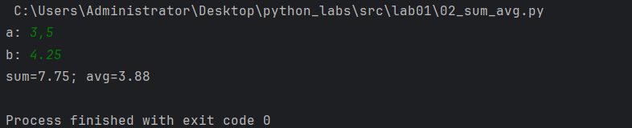


### Задание 3: 

```python
price = int(input())
discount = int(input())
vat = int(input())
base = price * (1 - discount/100)
vat_amount = base * (vat/100)
total = base + vat_amount
print(f"База после скидки: {base:.2f} ₽")
print(f"НДС:               {vat_amount:.2f} ₽")
print(f"Итого к оплате:    {total:.2f} ₽")
```
Результат выполнения:

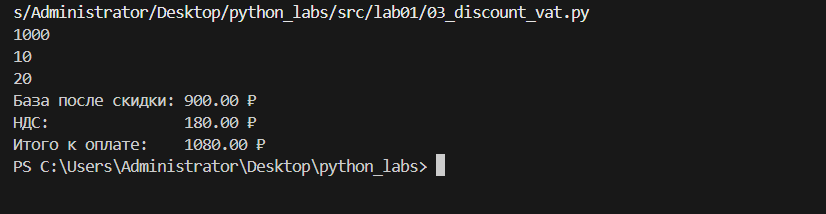

### Задание 4: 

```python
mm = int(input("Минуты: "))
hh = mm//60
print(f"{hh}:{(mm-60*hh):02d}")
```
Результат выполнения:

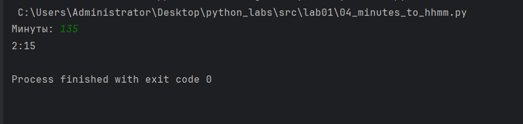

### Задание 5:

```python
fio = input("ФИО: ").split()
I = ''
for i in range(3):
    I += fio[i][0]
print(f"Инициалы: {I}.")
print(sum(len(i) for i in fio)+2)
```

Результат выполнения:

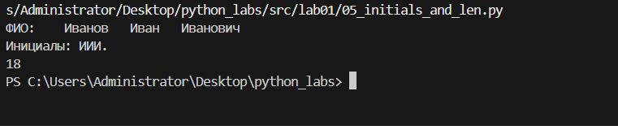


### Задание 6:
```python
n = int(input())
ochno = 0
for i in range(n):
    surname, name, age, form = map(str, input().split(' '))
    if form == 'True':
        ochno+=1
print(ochno, n-ochno)
```

Результат выполнения:

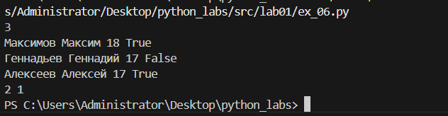

### Задание 7:
```python
cipher = input()
ans = ''
n = 0
for i in range(len(cipher)):
    if cipher[i].isupper():
        ans+=cipher[i]
        n = i+1
        break

for i in range(len(cipher)):
    for j in range(2,1000,3):
        if i == n+j:
            ans+=cipher[i]
print(ans)
```

Результат выполнения:

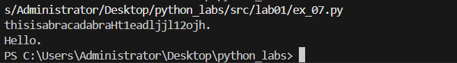


# Лабораторная работа 2
### Задание 1:

```python
def min_max(nums):
    if nums==[]:
        return 'ValueError'
    else:
        return (min(nums),max(nums))

def unique_sorted(nums):
    return sorted(set(nums), reverse=False)
def flatten(mat):
    new_mat = []
    for i in mat:
        for j in i:
            if type(j) == str:
                return 'TypeError'
            new_mat.append(j)
    return (new_mat)
```

Результат выполнения:

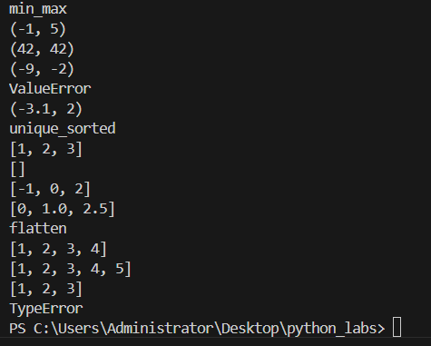

### Задание 2:

```python

def transpose(mat):
    if len(mat) == 0:
        return []
    elif len(mat) == 1:
        b = [[] for _ in range(len(mat[0]))]
        for i in range(len(mat[0])):
            b[i] += [(mat[0][i])]
        return b
    elif all(len(mat[i]) == 1 for i in range(len(mat))):
        c = [[]]
        for k in mat:
            c[0] += k
        return c
    elif all(len(mat[i]) == len(mat[i + 1]) for i in range(len(mat[0]) - 1)):
        a = [[] for _ in range(len(mat))]
        for k in range(len(mat)):
            for i in range(len(mat[0])):
                a[k] += [mat[i][k]]
        return a
    else:
        return 'ValueError'

def row_sums(mat):
    k = len(mat[0])
    ans = []
    for i in mat:
        if k == len(i):
            ans.append(sum(i))
        else:
            return 'ValueError'
    return ans

def col_sums(mat):
    ans = [0]*len(mat[0])
    k = len(mat[0])
    for i in range(len(mat)):
        if k==len(mat[i]):
            for j in range(len(mat[i])):
                ans[j]+=mat[i][j]
        else:
            return 'ValueError'
    return ans
```

Результат выполнения:

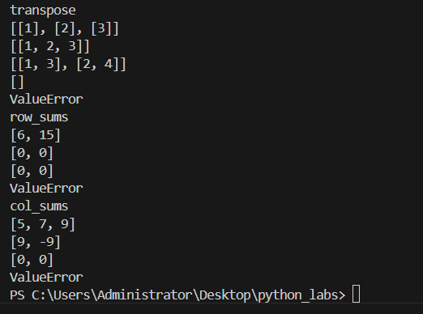

### Задание 3:

```python
fio_new = ''
flag1 = False
len_fio = 0
gpa = float
s = input().replace('(','').replace(')','').split(', ')
for i in s:
    if i == '':
        s.append('musor')
if len(s) == 3:
    fio_old = s[0].replace('''"''','').split(' ')
    for i in fio_old:
        if i != '' and flag1 == False:
            fio_new += str(i.capitalize())+' '
            len_fio+=1
            flag1 = True
        elif flag1 == True and i!='':
            fio_new += str(i.capitalize()[0]) + '.'
            len_fio+=1
    group = s[1].replace('''"''','')
    gpa = float(s[2])
    if 3>=len_fio>=2:
        print(f'''"{fio_new}, гр. {group}, GPA {gpa:.2f}"''')
    else:
        print('ValueError')
else: print('ValueError')
```

Результат выполнения:

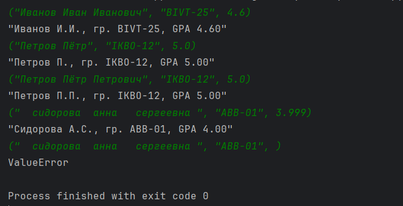


# Лабораторная работа 2
### Задание 1:

```python
import re
def normalize(text: str, casefold: bool, yo2e: bool):
    text = ' '.join(text.split())
    if casefold:
        text = text.casefold()
    if yo2e:
        text = text.replace("ё","е").replace('Ё', 'Е')
    return text

print(normalize("ПрИвЕт\nМИр\t", True,False))
print(normalize("ёжик, Ёлка", False,True))
print(normalize("Hello\r\nWorld", False,False))
print(normalize("  двойные   пробелы  ", False,False))
def tokenize(text: str):
    text=text.replace(',', ' ').replace('.',' ')
    return re.sub(r'[^a-zA-Zа-яА-Я0-9-\s]', '', text).split()
print(tokenize("привет мир"))
print(tokenize("hello,world!!!"))
print(tokenize("по-настоящему круто"))
print(tokenize("2025 год"))
print(tokenize("emoji 😀 не слово"))

def count_freq(tokens: list[str]):
    freq = {}
    for i in tokens:
        if i in freq:
            freq[i] += 1
        else:
            freq[i] = 1
    return freq
def top_n(freq: dict[str, int], n: int):
    s = sorted(freq.items(), key=lambda x: (-x[1], x[0]))
    return s[:n]
print(count_freq(["a","b","a","c","b","a"]))
print(top_n(count_freq(["a","b","a","c","b","a"]),2))
print((count_freq(["bb","aa","bb","aa","cc"])))
print(top_n(count_freq(["bb","aa","bb","aa","cc"]),2))
```

Результат выполнения:

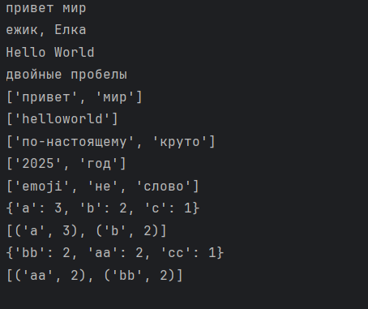

### Задание 2:

```python
import sys
import io

# true - красивый табличный вывод; false - стандарт
PRETTY_TABLE_OUTPUT = True

try:
    sys.stdin = io.TextIOWrapper(sys.stdin.buffer, encoding='utf-8')
    sys.stdout = io.TextIOWrapper(sys.stdout.buffer, encoding='utf-8')
    sys.stderr = io.TextIOWrapper(sys.stderr.buffer, encoding='utf-8')
except TypeError:
    pass

from text import normalize, tokenize, count_freq, top_n


def print_simple_output(total, unique, top_words):
    print(f"Всего слов: {total}")
    print(f"Уникальных слов: {unique}")
    print("Топ-5:")
    for word, count in top_words:
        print(f"{word}:{count}")


def print_pretty_table(total, unique, top_words):
    print(f"Всего слов: {total}")
    print(f"Уникальных слов: {unique}")

    if not top_words:
        print("Топ-5:")
        return

    header_word = "слово"
    max_len = max([len(word) for word, count in top_words] + [len(header_word)])

    header_freq = "частота"

    print(f"{header_word:<{max_len}} | {header_freq}")
    print(f"{'-' * max_len}-+-{'-' * len(header_freq)}")

    for word, count in top_words:
        print(f"{word:<{max_len}} | {count}")


input_text = sys.stdin.read()

normalized_text = normalize(input_text, casefold=True, yo2e=True)
tokens = tokenize(normalized_text)
total_words = len(tokens)

if total_words == 0:
    print("Всего слов: 0")
    print("Уникальных слов: 0")
    print("Топ-5:")
else:
    freq_dict = count_freq(tokens)
    unique_words = len(freq_dict)
    top_5_words = top_n(freq_dict, 5)

    if PRETTY_TABLE_OUTPUT:
        print_pretty_table(total_words, unique_words, top_5_words)
    else:
        print_simple_output(total_words, unique_words, top_5_words)
```
### Комментарии к выполнению:

```
Чтобы выполнить код для виндоус нужно запустить 
командную строку, переместиться в файл(cd ./путь):
 chcp 65001 && echo здесь текст | py text_stats.py
( chcp 65001 - переводим в кодировку UTF-8)
PRETTY_TABLE_OUTPUT - регулировка вывода, параметр True - красивый табличный вывод
параметр False - стандартный вывод
```

Результат выполнения:

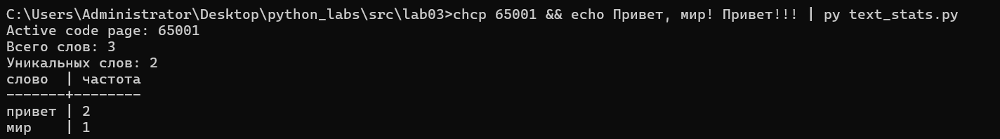