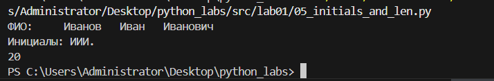

<h1>Python_Labs</h1>

# Лабораторная работа 1


## Задания

### Задание 1:

Программа выводит простое приветствие в консоль.

**Код:**
```python
name = input("Имя: ")
age = int(input("Возраст: "))
print(f"Привет, {name}! Через год тебе будет {age}.")
```
Результат выполнения:


### Задание 2: 

Код:

```python
a = (input("a: ")).replace(",",".")
b = (input("b: ")).replace(",",".")
print(f"sum={round(float(a)+float(b), 2)}; avg={round((float(a)+float(b))/2, 2)}")
```
Результат выполнения:


### Задание 3: 

```python
price = int(input())
discount = int(input())
vat = int(input())
base = price * (1 - discount/100)
vat_amount = base * (vat/100)
total = base + vat_amount
print(f"База после скидки: {base:.2f} ₽")
print(f"НДС:               {vat_amount:.2f} ₽")
print(f"Итого к оплате:    {total:.2f} ₽")
```
Результат выполнения:


### Задание 4: 

```python
mm = int(input("Минуты: "))
hh = mm//60
print(f"{hh}:{(mm-60*hh):02d}")
```
Результат выполнения:


### Задание 5:

```python
fio = input("ФИО: ").split()
I = ''
for i in range(3):
    I += fio[i][0]
print(f"Инициалы: {I}.")
print(sum(len(i) for i in fio)+2)
```

Результат выполнения:




### Задание 6:
```python
n = int(input())
ochno = 0
for i in range(n):
    surname, name, age, form = map(str, input().split(' '))
    if form == 'True':
        ochno+=1
print(ochno, n-ochno)
```

Результат выполнения:


### Задание 7:
```python
cipher = input()
ans = ''
n = 0
for i in range(len(cipher)):
    if cipher[i].isupper():
        ans+=cipher[i]
        n = i+1
        break

for i in range(len(cipher)):
    for j in range(2,1000,3):
        if i == n+j:
            ans+=cipher[i]
print(ans)
```

Результат выполнения:


